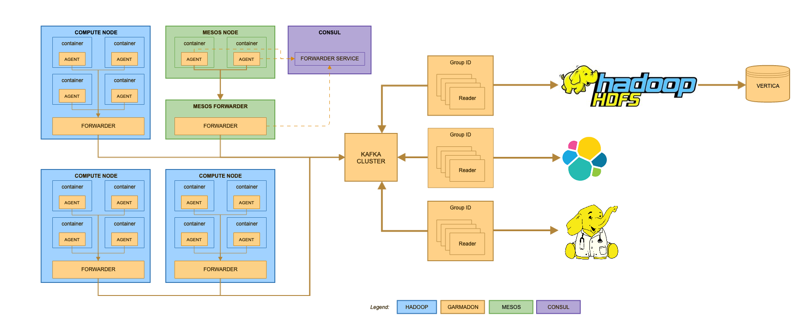
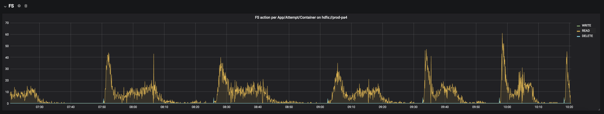
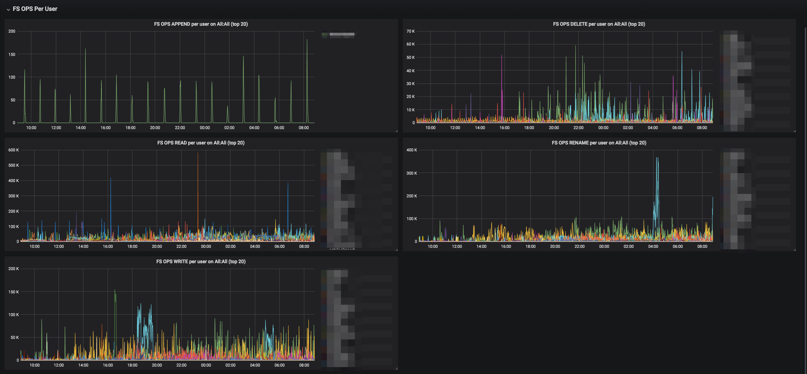

# Garmadon: Hadoop Cluster Introspection

<a href='https://travis-ci.org/criteo/garmadon/builds'></a>
[](https://maven-badges.herokuapp.com/maven-central/com.criteo.java/garmadon)

Garmadon is Criteo's home made solution for Hadoop Cluster realtime introspection. 

As someone who has already used Hadoop knows, it is very hard to get information from what has been running on the cluster,
despite logs and frameworks specific (Spark driver's UI for instance). It gets even harder to get that information when an application failed in an unexpected manner. 

* Why are my containers killed ?
* Is my container sizing correct ?
* What happened to stuck containers on this application ?
* What application is slowing down the HDFS layer by too much load on the namenode ?

At Criteo, we needed quick answers to those questions (and many more) while having millions of containers running per day.

Garmadon produces a stream of events from running java containers and Hadoop main components 
about JVM statistics (Compilation time, GCs, hot locks, etc...), framework specifics (Spark) 
and Hadoop specifics (NodeManager's container monitoring, yarn's applications states, hdfs calls, etc...).

That stream of events is used to build end-users and SRE teams dashboards, cluster resources usage optimisation, data lineage, etc...

If you want to see Garmadon in action, have a look at [the main features](#main-features). 

We constantly think of new way to make the best use of all that information that is now available and invite you to do so !
See [Contributing](#Contributing).

## Table of content

- [Architecture overview](#architecture-overview)
- [How to install](#how-to-install)
  * [Requirements](#requirements)
  * [Backend services sizing](#backend-services-sizing)
  * [Install Garmadon Reader for Elastic Search](#install-garmadon-reader-for-elastic-search)
  * [Install Garmadon forwarder](#install-garmadon-forwarder)
  * [Install Garmadon agent](#install-garmadon-agent)
  * [Checking your install](#checking-your-install)
- [Main features](#main-features)
  * [Dashboards](#dashboards)
    + [End users dashboards](#end-users-dashboards)
      - [Garmadon-yarn-application](#garmadon-yarn-application)
      - [Garmadon-standalone-jvm](#garmadon-standalone-jvm)
      - [Garmadon-spark-job](#garmadon-spark-job)
      - [Garmadon-spark-job-executors](#garmadon-spark-job-executors)
      - [Garmadon-spark-job-stages](#garmadon-spark-job-stages)
      - [Garmadon-flink-job](#garmadon-flink-job)
      - [Garmadon-flink-job-tasks](#garmadon-flink-job-tasks)
    + [SRE dashboard](#sre-dashboard)
      - [Garmadon-compute](#garmadon-compute)
      - [Garmadon-hdfs](#garmadon-hdfs)
      - [Garmadon-server-overview](#garmadon-server-overview)
  * [Frameworks metrics](#frameworks-metrics)
  * [Heuristics for DrElephant integration](#heuristics-for-drelephant-integration)
  * [HDFS dump for batch processing](#hdfs-dump-for-batch-processing)
  * [Other features](#other-features)
- [Release management](#release-management)
- [Monitoring Garmadon](#monitoring-garmadon)
- [Building Garmadon](#building-garmadon)
- [Contributing](#contributing)

## Architecture overview

Every hadoop container runs an agent that produces events. Those events are gathered by a process running on each cluster node (the forwarder) and sent to kafka.

They are then consumed by so-called readers to feed other systems (ElasticSearch, DrElephant, HDFS, etc...)

The agent is also deployed on NodeManagers, ResourceManagers and standalone JVMs to provided other types of events (HDFS accesses, container resource tracking, application state tracking, etc...)



The agent itself has a very low footprint on running containers. 


## How to install

We recommend to use the LATEST version of Garmadon (1.0.0)

### Requirements

Garmadon is designed for **Hadoop 2.6**. You can probably use Garmadon on other Hadoop 2 clusters but we cannot guarantee that for sure.

Garmadon integrates with any JVM based Yarn framework (mapreduce v1, v2, spark, flink, hive, etc...) and has specific extensions for **Spark 2** and **Flink**.

For non JVM applications, you will still get information from NodeManager and ResourceManger.

Beside being set up on the Hadoop Cluster, Garmadon relies on other services to work properly, at least **Kafka 2.0.1**, **Elastic Search 6.3.2** and **Grafana 5**.

This quick install guide won't cover the setup of those components and supposes they are already available in your infrastructure.

Also, part of this guide supposes to integrate configuration setups in your infrastructure management solution.
At Criteo we use chef, but none of the followings relies on the use of a specific IAAS solution.

### Backend services sizing

The load produced by Garmadon heavily depends on your cluster size, occupancy, the nature of containers you run, and Garmadon's own properties.

To help you dimension your ElasticSearch and Kafka cluster here are some stats that you should consider.

* Every NodeManager of your cluster will send 
  * 2 CONTAINER_MONITORING_EVENT per container actually running on the machine every time containers are monitored. This frequency is directly bound to the parameter _yarn.nodemanager.container-monitor.interval-ms_ defined in *yarn-site.xml*
  * 17 OS events every 30 seconds (configurable)
* Every container will send
  * 1 JVMSTATS_EVENT every 10 seconds (configurable)
  * 1 APPLICATION_STATE_EVENT every 10 second per application running on the RM
  * FS_EVENT when it performs HDFS actions
  * GC_EVENT when gc occurs
* Every spark container will in addition send Spark events from the Spark LiveListenerBus
* Every flink container will in addition send Flink events from the Flink Metrics if they add appropriate options to the Flink job


The size observed for those events on our production cluster:

| EventType   | Size observed in bytes (quantile 0.99) | Comment |
| -----------:| --------------------------------------:| -------:|
| CONTAINER_MONITORING_EVENT | 261 | predictive value |
| JVMSTATS_EVENT / OS_EVENT / GC_EVENT | 1920 | predictive value |
| SPARK_TASK_EVENT | 157786 | depends partly on the actual running application |
| FS_EVENT | 800 | mostly depends on paths sizes |
| STATE_EVENT | missing value | predictive value |

Some of the load is predictable (and tunable) but a big part of the load is also very depending on the number of container you run, their life span, the framework you use, etc...

We provide you what we observe on our production cluster. It is a 2900 nodes cluster on which we run around 25 million containers per day.

On this cluster, Garmadon generates :
* around 45k events/sec
* from 9TB to 10TB of data per day on Kafka (not including replication)
* from 30GB to 40GB per hour in ElasticSearch (not including replication)

Here is the event repartition on ElasticSearch cluster over a 4h period


### Install Garmadon Reader for Elastic Search

#### Configure Elastic Search

You can update index configuration (*number_of_shards*, *number_of_replica*, *refresh_interval*, *merge.scheduler.max_thread_count*, ...) by adding a garmadon-config.yml at the beginning of the classpath. It will replace this default one [readers/elasticsearch/src/main/resources/garmadon-config.yml](readers/elasticsearch/src/main/resources/garmadon-config.yml)]

Index configurations will be pushed in a garmadon template by the Elastic Search reader at startup with all fields mapping.

The current code expects the use of a _hourly index_.

#### Configure Grafana

Your Elastic Search cluster has to be configured as a datasource for Grafana. The current dashboards templates expects a datasource named "garmadon". You will then see it on the datasource dropdown menu of each dashboards (we used it to select between different clusters, each having their own Garmadon infrastructure).

Then you can import JSON from [readers/elasticsearch/src/main/elasticsearch/grafana](readers/elasticsearch/src/main/elasticsearch/grafana) in your Grafana and use the Elastic Search datasource.

### Install Garmadon Elasticsearch reader

Garmadon-readers-elasticsearch's jar can be fetch from maven central:
```
<dependency>
  <groupId>com.criteo.java</groupId>
  <artifactId>garmadon-readers-elasticsearch</artifactId>
  <version>0.0.1</version>
</dependency>
```

#### Configure Garmadon Elasticsearch reader

1. Create a configuration directory of your choice
2. Create a __garmadon-config.yml__ file in this directory
 
 Below is a recommended example:
 ```
 elasticsearch:
   host: elasticsearch                     # ES host
   port: 9200                              # ES port
   user: esuser                            # OPTIONAL: ES username (DEFAULT: null)
   password: espassword                    # OPTIONAL: ES password (DEFAULT: null)
   indexPrefix: garmadon                   # OPTIONAL: ES index prefix (DEFAULT: garmadon)
   bulkConcurrent: 10                      # OPTIONAL: Number of thread pushing events to ES asynchronously (DEFAULT: 10)
   bulkActions: 500                        # OPTIONAL: Flush bulk every bulkActions event (DEFAULT: 500)
   bulkSizeMB: 5                           # OPTIONAL: Flush bulk ever bulkSizeMB mb (DEFAULT: 5)
   bulkFlushIntervalSec: 10                # OPTIONAL: Flush bulk ever bulkFlushIntervalSec s (DEFAULT: 10)
   ilmForceMerge: false                    # OPTIONAL: Force merge of segment to 1 during warm phase of the garmadon life cycle policy         
   ilmTimingDayForWarmPhase: 2             # Number of days before moving index to ilm warm phase (https://www.elastic.co/guide/en/elasticsearch/reference/current/index-lifecycle-management.html)
   ilmTimingDayForDeletePhase: 4           # Number of days before deleting index
   settings:                               # Any index settings to put on the garmadon template
     index.number_of_shards: 10
     index.number_of_replicas: 2
     merge.scheduler.max_thread_count: 1
     translog.flush_threshold_size: 1gb
     refresh_interval: 30s
     unassigned.node_left.delayed_timeout: 15m
 kafka:
   settings:                               # Any consumer kafka settings
     bootstrap.servers: kafka:9092
     group.id: es-reader
 prometheus:
   port: 31001
 ```
3. [Optional] You can add a standard logback.xml file in this directory:
 ```$xslt
<configuration  scan="true" scanPeriod="60 seconds">
  <appender name="FILE" class="ch.qos.logback.core.rolling.RollingFileAppender">
    <file>/var/log/garmadon/garmadon.log</file>
    <rollingPolicy class="ch.qos.logback.core.rolling.TimeBasedRollingPolicy">
      <!-- daily rollover -->
      <fileNamePattern>garmadon.%d.gz</fileNamePattern>

      <!-- Adapt to your needs -->
      <maxHistory>7</maxHistory>
      <totalSizeCap>3GB</totalSizeCap>

    </rollingPolicy>

    <encoder>
      <pattern>%date %level [%thread] %logger{10} [%file:%line] %msg%n</pattern>
    </encoder>
  </appender>

  <root level="INFO">
    <appender-ref ref="FILE" />
  </root>
</configuration>
   ```


#### Run Garmadon Elasticsearch reader instances

Start as many instances as you want (with same kafka -> settings -> group.id):

<pre>
java -XX:+UseG1GC -Xms1g -Xmx1g -cp <b><i>path-to-garmadon-readers-elasticsearch-conf-folder</i></b>:<b><i>path-to-garmadon-readers-elasticsearch-jar</i></b> com.criteo.hadoop.garmadon.elasticsearch.ElasticSearchReader
</pre>

### Install Garmadon forwarder

Garmadon-forwarder's jar can be fetch from maven central:
```
<dependency>
  <groupId>com.criteo.java</groupId>
  <artifactId>garmadon-forwarder</artifactId>
  <version>0.0.1</version>
</dependency>
```

Garmadon-forwarder has to be running on all machines that will run the agent (see [below](#install-garmadon-agent)). That can be:
- Cluster nodes
- Hadoop services nodes (Yarn Resource Manager, etc...)
- Standalone machines that host JVM performing HDFS calls via Hadoop libraries


#### Configure Garmadon-forwarder

1. Create a configuration directory of your choice
2. Create a __server.properties__ file in this directory
 
 Below is a recommended example:
 ```
 #
 # Forwarder config
 #
 forwarder.port=31000 # Garmadon-agent will try to connect on port 31000 by default. This is however tunable.
 forwarder.worker.thread=1 # Adapt to your needs 
 
 #
 # This property is for specific usage
 # Don't change it 
 #
 forwarder.tags=NODEMANAGER
 
 #
 # Kafka
 #
 # This configuration is kafka's producer standard configuration
 # You can add any other conf supported by Kafka producer to fit your needs
 #
 bootstrap.servers=your_kafka_bootstrap_servers
 key.serializer=org.apache.kafka.common.serialization.StringSerializer
 value.serializer=org.apache.kafka.common.serialization.ByteArraySerializer
 acks=0
 ```
3. [Optional] You can add a standard logback.xml file in this directory:
 ```$xslt
<configuration  scan="true" scanPeriod="60 seconds">
  <appender name="FILE" class="ch.qos.logback.core.rolling.RollingFileAppender">
    <file>/var/log/garmadon/garmadon.log</file>
    <rollingPolicy class="ch.qos.logback.core.rolling.TimeBasedRollingPolicy">
      <!-- daily rollover -->
      <fileNamePattern>garmadon.%d.gz</fileNamePattern>

      <!-- Adapt to your needs -->
      <maxHistory>7</maxHistory>
      <totalSizeCap>3GB</totalSizeCap>

    </rollingPolicy>

    <encoder>
      <pattern>%date %level [%thread] %logger{10} [%file:%line] %msg%n</pattern>
    </encoder>
  </appender>

  <root level="INFO">
    <appender-ref ref="FILE" />
  </root>
</configuration>
   ```

#### Run the service
1. Deploy Garmadon-forwarder's jar in the directory of your choice
2. Garmadon-forwarder is expected to be a running service on machines that will gather events from the cluster
 <pre>
 java -Xms1g -Xmx1g -XX:+UseG1GC -cp <b><i>path-to-garmadon-conf-dir</i></b>:<b><i>path-to-garmadon-forwarder-jar</i></b> com.criteo.hadoop.garmadon.forwarder.Forwarder
 </pre>

 You can adapt JVM properties to a proper sizing reflecting your actual load and resource capabilities.

### Install Garmadon agent

Garmadon-agent's jar can be fetch from maven central:
```
<dependency>
  <groupId>com.criteo.java</groupId>
  <artifactId>garmadon-agent</artifactId>
  <version>0.0.1</version>
</dependency>
```

#### Activate on NodeManagers

Activating Garmadon-agent on NodeManagers will provide:
- machine metrics (cpu, memory, etc...)
- container resources tracking metrics. 
 __VCore usage tracking will require yarn.NodeManager.container-metrics.enable from yarn-site.xml to be set to true__

1. [Install Garmadon-forwarder](#install-garmadon-forwarder) on all cluster nodes 
2. Deploy Garmadon-agent on all cluster nodes in the directory of your choice
3. Update YARN_NODEMANAGER_OPTS env variable in your NodeManager start scripts with this property
 <pre>
 -javaagent:<b><i>path-to-garmadon-agent.jar</i></b>=com.criteo.hadoop.garmadon.agent.modules.NodeManagerModule
 </pre>
4. Restart all NodeManagers

#### Activate on containers

Activating Garmadon-agent on containers will provide:
- JVM monitoring metrics
- framework specific metrics (Spark and Flink are the only framework that benefit specific metrics for now)
- HDFS interaction metrics

1. [Install Garmadon-forwarder](#install-garmadon-forwarder) on all cluster nodes 
2. Deploy Garmadon-agent on all cluster nodes in the directory of your choice
3. Configure yarn.NodeManager.admin-env in yarn-site.xml to set 
 <pre>
 JAVA_TOOL_OPTIONS=-javaagent:<b><i>path-to-garmadon-agent-jar</i></b>=com.criteo.hadoop.garmadon.agent.modules.ContainerModule
 </pre>
4. Deploy the configuration on the cluster
5. Restart all NodeManagers

#### Activate on ResourceManagers

Activating Garmadon-agent on ResourceManagers will provide:
- applications status tracking

1. [Install Garmadon-forwarder](#install-garmadon-forwarder) on your ResourceManager servers
2. Deploy Garmadon-agent on your ResourceManager servers
3. Update YARN_RESOURCEMANAGER_OPTS env variable in your ResourceManager start scripts with this property 
 <pre>
 -javaagent:<b><i>path-to-garmadon-agent.jar</i></b>=com.criteo.hadoop.garmadon.agent.modules.ResourceManagerModule
 </pre>
4. Restart all ResourceManagers

#### [OPTIONAL] Activate Garmadon agent on any JVM

Activating Garmadon-agent on a standalone JVM will provide:
- HDFS interaction metrics realized outside of containers

Since most of our data pipelines execute actions on HDFS directories outside of yarn containers, we force the use of Garmadon-agent on cluster gateway's by setting:
<pre>
JAVA_TOOL_OPTIONS=-javaagent:<b><i>path-to-garmadon-agent-jar</i></b>=com.criteo.hadoop.garmadon.agent.modules.StandaloneModule
</pre>
in users env.

You can use any technique that fit your needs to load Garmadon-agent on any JVM that's performing HDFS calls with Hadoop library classes.

**Just make sure to use com.criteo.hadoop.garmadon.agent.modules.StandaloneModule and to have a running forwarder beside the instrumented JVM.** 

To ease the filtering of event from any standalone application we provide capabilities to set tags. For this add the garmadon.tags java properties with a list of tags
separated by a comma. Tags naming should only contains alpha-numeris and "-|_|." chars.
<pre>
JAVA_TOOL_OPTIONS=-javaagent:<b><i>path-to-garmadon-agent-jar</i></b>=com.criteo.hadoop.garmadon.agent.modules.StandaloneModule <b><i>-Dgarmadon.tags=tags1,tags2</i></b>
</pre>

#### Activate consul discovery

In order to activate consul discovery for garmadon forwarder instead of local garmandon forwarder, you need to add those parameters to your JVM.

<pre>
<b><i>-Dgarmadon.discovery=consul -Dgarmadon.consul.service=FORWARDER_CONSUL_SERVICE_NAME</i></b>
</pre>

### Checking your install

At this point, garmadon events should already feed your elasticsearch cluster (NodeManager's agent produces system metrics).

Check that your NodeManager processes command line contains:
```
-javaagent:/usr/lib/hadoop-criteo/garmadon/lib/garmadon-agent.jar=com.criteo.hadoop.garmadon.agent.modules.NodeManagerModule
```

Check that your ResourceManager processes command line contains:
```
-javaagent:/usr/lib/hadoop-criteo/garmadon/lib/garmadon-agent.jar=com.criteo.hadoop.garmadon.agent.modules.ResourceManagerModule
```

Now, launch Yarn applications and see container metrics populate your dashboards.

Your container's log should contain:

```
[main] INFO com.criteo.hadoop.garmadon.agent.EventAgent - Starting Garmadon Agent Version ....
```

## Main features

### Dashboards

**All dashboards are based on realtime data generated by Garmadon.**

_The following screenshots have high definition, don't hesitate to zoom-in_

#### End users dashboards

End users dashboard provide "per application" information

##### Garmadon-yarn-application 

This dashboard is applicable to all applications running on your cluster. For JVM based containers, you will benefit specific tab with JVM metrics.

If you don't select a specific containers, the following panels will display _max value_ and _average_.
That can be useful if you want to check a threshold on a lot of containers. 

For instance, what is the max heap occupancy across all mappers of a job ?

**Make you sure your grafana time range includes data of the application you want to display !**

**If not, the application will not be selectable in the drop-down list and even if you paste the application id, there will be no data in this time range to be displayed.**

**If the application id is still not visible, it is probably due to the [max terms](https://www.elastic.co/guide/en/elasticsearch/reference/current/query-dsl-terms-query.html) being taken from Elastic Search to display the dropdown list. In this case, pasting the application id in the menu will display data.**


The tab "Container" displays information on resource usage, **as seen by the nodemanager**


The JVM tab contains panels about JVM memory management (heap sizing and GC) and runtime (Threads, Opened file descriptors). JVM instances are identified by PID because nothing prevents a Yarn container to run several JVMs.


The JVM advanced tab shows compilation and locking information


The FS tab shows HDFS actions initiated by the containers (CREATE, WRITE, READ, DELETE, APPEND)


##### Garmadon-standalone-jvm

This dashboard is the same as Garmadon-yarn-application, but it does not contain the Container tab, since a standalone JVM does not run on the Hadoop cluster. We alsdo use different filters to fit the use case (hostname and PID). 


##### Garmadon-spark-job

This dashboard is specific to spark jobs. We use it on Spark 2.2 and Spark 2.3. Some common use cases are :
* tasks cpu footprint
* detection of executors being killed by the nodemanager or blacklisted
* detection of costly serialization
* detection of abnormal shuffle phases 


##### Garmadon-spark-job-executors

This dashboard is specific to spark jobs. We use it on Spark 2.2 and Spark 2.3. Same as Garmadon-spark-job, except that the information is seen per executor. Particularly useful to check if the load is evenly distributed to every spark executor and to find badly behaved executors. 


##### Garmadon-spark-job-stages

This dashboard is specific to spark jobs. We use it on Spark 2.2 and Spark 2.3. Same as Garmadon-spark-job, except that the information is seen per stage. Useful to check task locality across the job execution. 


##### Garmadon-flink-job

This dashboard is specific to flink jobs. We use it on Flink 1.6.

It provide an overview of the flink job:
* number of jobs/tasks running
* checkpointing size/duration
* availibility of jobs (number of restart/duration being unavailable)
* kafka consumer metrics (lags, rate)


##### Garmadon-flink-job-tasks

This dashboard is specific to flink jobs. We use it on Flink 1.6.

It provide a more detailed view on tasks
* IO records/bytes
* Network buffer/queues usage
* Operators metrics (kafka, watermark)


#### SRE dashboard

SRE dashboards provide aggregated information that helps in cluster management

##### Garmadon-compute

This dashboard helps us in managing the Yarn side of Hadoop

It is split in 4 tabs


Yarn overview shows the resource usage usage on the cluster. That helps capacity planning, but also job's configuration since you can check the difference between the reserved resources and their actual usage on the cluster (memory only for now).


The other tabs are useful to check the usage of the cluster per application, per user usage and per framework usage.


##### Garmadon-hdfs

This dashboard helps us to identify HDFS load coming from running containers on the cluster. We can see what are the most used actions, what application/user causes them, what paths are the most used, etc... with different point of view (user, application, framework/component, etc...).
This dashboard helped us many time in finding the application causing slowness on HDFS (and slowing down the whole cluster as a consequence).




##### Garmadon-server-overview

A dashboard specific to yarn nodes resources.


### Frameworks Metrics

Currently only spark is supported

#### Spark

It is based on Spark Listener mechanism.

The garmadon agent will automatically attached the garmadon spark listener on the driver if StandaloneModule 
*(-javaagent:path-to-garmadon-agent-jar=com.criteo.hadoop.garmadon.agent.modules.StandaloneModule)* 
or ContainerModule *(-javaagent:path-to-garmadon-agent-jar=com.criteo.hadoop.garmadon.agent.modules.ContainerModule) are used.


Here is the set of dashboards based on metrics from garmadon spark listener:
  - [Garmadon-spark-job](#garmadon-spark-job)
  - [Garmadon-spark-job-executors](#garmadon-spark-job-executors)
  - [Garmadon-spark-job-stages](#garmadon-spark-job-stages)
  

#### Flink

It is based on Flink metric reporter.

You will have to specify the metrics reporters to add to your flink job adding this flink parameters *(-yD metrics.reporters=garmadon
 -yD metrics.reporter.garmadon.class=com.criteo.hadoop.garmadon.flink.GarmadonFlinkReporter)* and ensuring garmadon agent
is also set to the JVM if StandaloneModule *(-javaagent:path-to-garmadon-agent-jar=com.criteo.hadoop.garmadon.agent.modules.StandaloneModule)* 
or ContainerModule *(-javaagent:path-to-garmadon-agent-jar=com.criteo.hadoop.garmadon.agent.modules.ContainerModule)* are used.


Here is the set of dashboards based on metrics from garmadon spark listener:
  - [Garmadon-spark-job](#garmadon-spark-job)
  - [Garmadon-spark-job-executors](#garmadon-spark-job-executors)
  - [Garmadon-spark-job-stages](#garmadon-spark-job-stages)

### Heuristics for DrElephant integration

Not documented yet

### HDFS dump for batch processing

Used to flush metrics per events and days on hdfs parquet table.

It is usefull for long term retention like capacity planning requests.

#### Install Garmadon HDFS reader for batch processing

Garmadon-readers-hdfs's jar can be fetch from maven central:
```
<dependency>
  <groupId>com.criteo.java</groupId>
  <artifactId>garmadon-readers-hdfs</artifactId>
  <version>0.0.1</version>
</dependency>
```

#### Configure Garmadon HDFS reader

1. Create a configuration directory of your choice
2. Create a __garmadon-config.yml__ file in this directory
 
 Below is a recommended example:
 ```
 hdfs:
   finalDir: /tmp/hdfs-exporter/final           # Hdfs folder where final parquet files are moved
   baseTemporaryDir: /tmp/hdfs-exporter/temp    # Temporary hdfs folder where parquet file are created and append
   messagesBeforeExpiringWriters: 3000000       # OPTIONAL: Soft limit (see 'expirerPeriod') for number of messages before writing final files (DEFAULT: 3 000 000)
   writersExpirationDelay: 30                   # OPTIONAL: Soft limit (see 'expirerPeriod') for time since opening before writing final files (in minutes) (DEFAULT: 30)
   expirerPeriod: 30                            # OPTIONAL: How often the exporter should try to commit files to their final destination, based on messagesBeforeExpiringWriters' and 'writersExpirationDelay' (in seconds) (DEFAULT: 30)
   heartbeatPeriod: 320                         # OPTIONAL: How often a placeholder file should be committed to keep track of maximum offset  with no message for a given event type (in seconds) (DEFAULT: 320)
   maxTmpFileOpenRetries: 10                    # OPTIONAL: Maximum number of times failing to open a temporary file (in a row) before aborting the program (DEFAULT: 10)
   tmpFileOpenRetryPeriod: 30                   # OPTIONAL: How long to wait between failures to open a temporary file for writing (in seconds) (DEFAULT: 30)
   sizeBeforeFlushingTmp: 16                    # OPTIONAL: How big the temporary files buffer should be before flushing (in MB) (DEFAULT: 16)
   backlogDays: 2	  			# OPTIONAL: How many days to search for the latest HDFS offset in, thereby avoiding to scan all directories (DEFAULT: 2)
 kafka:
   settings:                                    # Any consumer kafka settings
     bootstrap.servers: kafka:9092
     group.id: hdfs-reader
 prometheus:
   port: 31001
 ```
3. [Optional] You can add a standard logback.xml file in this directory:
 ```$xslt
<configuration  scan="true" scanPeriod="60 seconds">
  <appender name="FILE" class="ch.qos.logback.core.rolling.RollingFileAppender">
    <file>/var/log/garmadon/garmadon.log</file>
    <rollingPolicy class="ch.qos.logback.core.rolling.TimeBasedRollingPolicy">
      <!-- daily rollover -->
      <fileNamePattern>garmadon.%d.gz</fileNamePattern>

      <!-- Adapt to your needs -->
      <maxHistory>7</maxHistory>
      <totalSizeCap>3GB</totalSizeCap>

    </rollingPolicy>

    <encoder>
      <pattern>%date %level [%thread] %logger{10} [%file:%line] %msg%n</pattern>
    </encoder>
  </appender>

  <root level="INFO">
    <appender-ref ref="FILE" />
  </root>
</configuration>
   ```


#### Run Garmadon HDFS reader instances

Start as many instances as you want (with same kafka -> settings -> group.id):

<pre>
java -XX:+UseG1GC -Xms1g -Xmx1g -cp <b><i>path-to-garmadon-readers-hdfs-conf-folder</i></b>:<b><i>path-to-garmadon-readers-hdfs-jar</i></b>:$(hadoop classpath) com.criteo.hadoop.garmadon.hdfs.HdfsExporter
</pre>


### Other features

#### HDFS URI standardization

If you declare multiple HDFS clusters in the same hadoop configuration (and possibly with ViewFS namenode federation enabled) you might want to convert concrete HDFS uri to abstract nameservices.

That helps standardize HDFS metrics between preprod and prod environments.

This configuration needs to be inserted in a _hdfs-mapping.properties_ file in a directory of your choice and put in the classpath.

For instance, this an example with two environments and HDFS federation with 2 nameservices.

In the hdfs-mapping.properties file of the preprod instance:
```
# PREPROD CONFIGURATION
root=preprod
logs=logs-preprod
```

In the hdfs-mapping.properties file of the prod instance:
```
# PROD CONFIGURATION
root=prod
logs=logs-prod
```

This is part of reader common, so for each garmadon reader, you may add this configuration.

## Release management

We do our best to release non breaking changes. If a breaking change occurs, since we test it first on our cluster we will provide meaningful guide to migrate.

## Monitoring Garmadon

For ElasticSearch and Kafka, we have no rule of thumb and let you rely on your own monitoring solution.

For custom Garmadon components, monitoring is based on [prometheus](https://prometheus.io/). If you want to provide other monitoring integration, please [contribute](#contributing).

For now, Garmadon-forwarder and Garmadon-reader exposes metrics that can be fetched by prometheus.

### Garmadon-forwarder

By default, metrics are exposed on _http://**forwarder_host**:31001/metrics_

Garmadon-forwarder exposes on this endpoint:
* JVM metrics expose by default by prometheus client [https://github.com/prometheus/client_java#included-collectors](https://github.com/prometheus/client_java#included-collectors)
* Kafka producer JMX metrics [https://docs.confluent.io/current/kafka/monitoring.html#producer-metrics](https://docs.confluent.io/current/kafka/monitoring.html#producer-metrics)
* Garmadon event size quantiles
* Counters on events received/in error

Fetch _http://**forwarder_host**:31001/metrics_ on a running forwarder for details on the gauge names and labels

### Garmadon-reader

By default, metrics are exposed on _http://**reader_host**:**reader_prometheus_port**/metrics_ (there is no default port for prometheus client on readers as it is forced at launch time)

Garmadon-reader exposes on this endpoint:
* JVM metrics exposed by default by prometheus client [https://github.com/prometheus/client_java#included-collectors](https://github.com/prometheus/client_java#included-collectors)
* Kafka consumer JMX metrics [https://docs.confluent.io/current/kafka/monitoring.html#new-consumer-metrics](https://docs.confluent.io/current/kafka/monitoring.html#new-consumer-metrics)
* Counters on issues arising when reading protobuf events

Fetch _http://**reader_host**:**reader_prometheus_port**/metrics_ on a running reader for details on the gauge names and labels

## Building Garmadon

```
mvn clean package
```

## Contributing

If you find issues, please use the github issues tab to advice use.

If you have a fix for an issue, first make sure you created the issue on github and propose your merge request from a forked repository.

If you propose a new feature, just create a pull request from a forked repository.
